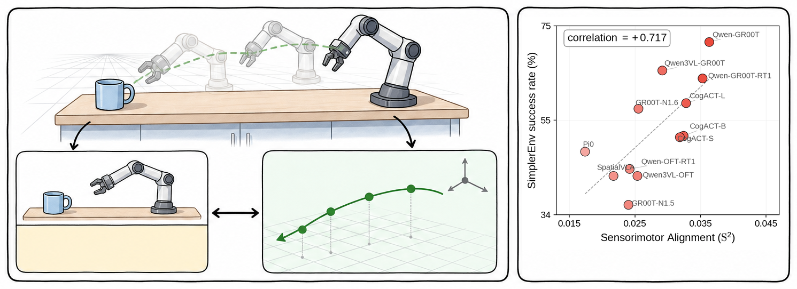
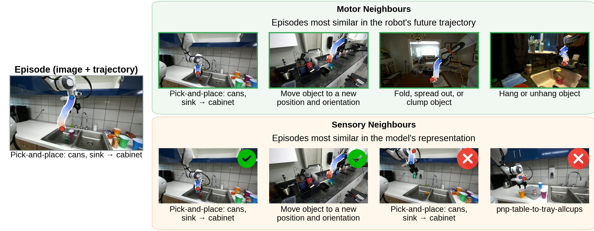
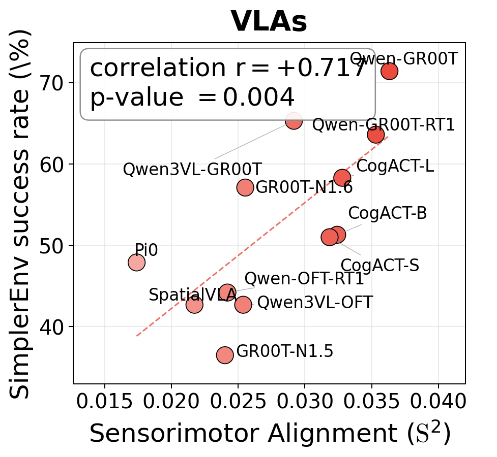
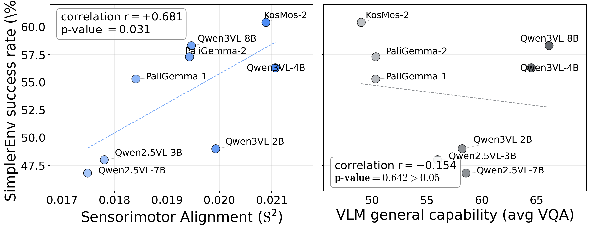
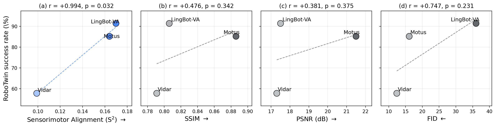

<h1 align="center">Sensorimotor Alignment:<br>A Platonic Proxy for Embodied Policy Success</h1>

<p align="center">
  <a href="#"></a>
  <a href="#"></a>
</p>

<p align="center">
  <a href="https://yunfeixie233.github.io/">Yunfei Xie</a><sup>1</sup>,
  <a href="https://howardqian201.github.io/">Howard H. Qian</a><sup>1</sup>,
  <a href="https://voidrank.github.io/">Shiyi Lan</a><sup>2</sup>,
  <a href="https://hangkaiyu.github.io/">Kaiyu Hang</a><sup>1</sup>,
  <a href="https://weichen582.github.io/">Chen Wei</a><sup>1</sup>
  <br>
  <sup>1</sup>Rice University, <sup>2</sup>NVIDIA
</p>



Robotic foundation models are typically evaluated through costly closed-loop rollouts, which motivates cheap offline proxies for model capability. The [Platonic Representation Hypothesis (PRH)](https://phillipi.github.io/prh/) suggests that as representations improve, different modalities such as vision and language converge toward a shared statistical model of reality. **We ask whether motion trajectories form another such modality: as robot models become more capable, should their sensory representations converge toward the structure of physical action?**

To examine this, we propose **Sensorimotor Alignment (S²), a training-free offline metric that measures how well a model's sensory representation aligns with the geometry of physical action by comparing sensory and trajectory similarity structures** (figure above, left).

```python
S² = CKNNA(K_sensory, K_motor)   # K_sensory = cosine top-k on model feats
                                 # K_motor   = SO(3)-geodesic DTW top-k on trajectories
```

Crucially, S² consistently and strongly correlates with downstream robot task success across embodied model families (figure above, right), making it a low-cost evaluation proxy. It can also identify promising VLM backbones even *before* costly VLA fine-tuning (see [Reproducing VLM-SR](#reproducing-vlm-sr)).

Moreover, we show that S², as a diagnostic lens, can explain how design choices shape where control-relevant structure is represented in the model (see [Reproducing Additional Findings (§4)](#reproducing-additional-findings-4)).

## News

(updates will be posted here)

## Contents

- [News](#news)
- [Pipeline Overview](#pipeline-overview): what S² is and the 5-stage pipeline
- [Setup](#setup): universal `starVLA` env plus per-model envs
- [Reproducing VLA-SR](#reproducing-vla-sr) (§3.1)
- [Reproducing VLM-SR](#reproducing-vlm-sr) (§3.2)
- [Reproducing WAM-SR](#reproducing-wam-sr) (§3.3)
- [Reproducing Additional Findings (§4)](#reproducing-additional-findings-4): modality, freeze, denoise, per-layer, paradigm
- [Raw S² values and figure regeneration](#raw-s-values-and-figure-regeneration) (no GPU needed)
- [Models tested](#models-tested): the 12 VLAs / 8 raw VLMs / 3 WAMs / 23 standalone vision encoders that the paper covers
- [Troubleshooting and FAQ](#troubleshooting-and-faq)
- [Smoke Tests](#smoke-tests)
- [Disk Layout of Pipeline Caches](#disk-layout-of-pipeline-caches)
- [Repository Layout](#repository-layout)
- [Citation and acknowledgement](#citation-and-acknowledgement)

## Pipeline Overview

Reproducing any experiment in the paper requires five stages: (1) **dataset preparation**, (2) **feature extraction**, (3) **motor kernel** (DTW on trajectories), (4) **sensorimotor alignment (S²)** scored with CKNNA, and (5) **figures**.

1. **Dataset preparation** (`data/`). Read RLDS or LeRobot shards, select a fixed N-episode subset, emit images, 7-D proprioceptive trajectories, and actions.
2. **Feature extraction** (`extractors/`, `vision_encoder/`). Run a frozen model on the per-episode observation frame (one image per episode). Save 7 internal-feature views per model as `feats_A_*.pt`: the ViT output, plus the vision-only, text-only, and joint vision-text representations at both the LLM input and the LLM output.
3. **Motor kernel via DTW** (`compute/compute_dtw.py`). Compute pairwise SO(3)-geodesic DTW (or 14-D Euclidean DTW for ALOHA) between every trajectory pair. Cache the top-k neighbor mask per horizon.
4. **Sensorimotor alignment (S²)** (`compute/compute_cknna.py`). Combine the model's cosine top-k with the trajectory top-k mask via mutual-kNN HSIC (the CKNNA algorithm). Emit one row per `(model, feature, horizon)`.
5. **Figures and tables.** Read the S² CSV and the success-rate CSV, render scatter plots and Pearson r tables.



For one DROID episode's observation frame (left), the motor kernel picks four trajectory-similar neighbors; a high-S² model's cosine top-k recovers most of them while a low-S² model picks visually similar but behaviorally different episodes.

| Stage                          | Code                              | Wall time (1× A100)                                              | Disk added                              |
|--------------------------------|-----------------------------------|------------------------------------------------------------------|-----------------------------------------|
| Dataset preparation            | `data/`                           | 1–3 h per reference dataset (download + RLDS scan)               | 0.6 GB per reference dataset            |
| Feature extraction             | `extractors/`, `vision_encoder/`  | ≈1 h per VLA or raw VLM, ≈5 h per WAM, ≈10 min per standalone ViT; **≈50 GPU-h total** for all 46 models in the paper | 8 GB per reference dataset (≈6,000 episodes) |
| Motor kernel (DTW)             | `compute/compute_dtw.py`          | 1–4 h per reference dataset (all 10 horizons); **≈5–10 GPU-h total** across DROID + BridgeV2 + ALOHA | 1–2 GB per reference dataset            |
| Sensorimotor alignment (S²)    | `compute/compute_cknna.py`        | 1–3 min (all models × 7 feat × 10 h)                             | 0.1 GB                                  |
| Figures                        | figure scripts                    | seconds                                                          | < 10 MB                                 |

If you only want to look up the raw S² value for any model in the paper, or regenerate the paper's figures without re-running the pipeline, skip directly to [Raw S² values and figure regeneration](#raw-s-values-and-figure-regeneration) below.

## Setup

These steps are universal across every experiment below.

**The pipeline relies on one universal environment for the model-independent stages, plus one isolated environment per model family.** Our pipeline calls many model families (StarVLA, CogACT, GR00T-N1.5/N1.6, Pi0, SpatialVLA, Motus, LingBot-VA, Vidar, …), and each has its own conflicting Python, CUDA, transformers, and diffusers pins, so they cannot coexist in a single env. Each per-experiment section below therefore installs only the model envs it needs, and you only have to install the envs for the models you actually run. We use the `starVLA` env as the universal default for the four model-independent stages, namely Dataset preparation, Motor kernel, Sensorimotor alignment (S²), and Figures, because it has the broadest dependency footprint of any single model env and the pipeline code for those four stages runs inside it cleanly. Reproducing any single experiment therefore only needs `starVLA` plus that experiment's model env(s).

```bash
git clone https://github.com/yunfeixie233/sensorimotor-alignment.git
cd sensorimotor-alignment

# Copy the path template and edit the two lines marked `# EDIT:` for your machine.
cp paths.env.example paths.env
$EDITOR paths.env
set -a && source paths.env && set +a

# Create the universal starVLA env (PyTorch 2.6.0 + CUDA 12.4 + transformers 5.3.0 + TensorFlow 2.21)
conda env create -f repro_envs/yaml/starVLA.yaml
conda activate starVLA
pip install adjustText                              # used by figure scripts

# Verify the install
conda run -n starVLA python tests/test_paths.py     # → 17 required OK (7 optional may be missing pre-extraction)
conda run -n starVLA python tests/test_imports.py   # → 10 passed
```

If conda resolution stalls on any env, fall back to pip from the matching lockfile:

```bash
conda create -n <env> python=<X.Y> -y && conda activate <env>
pip install torch==<ver> torchvision==<ver> \
    --index-url https://download.pytorch.org/whl/cu<XYZ>
pip install -r repro_envs/<env>.requirements.txt --no-cache-dir
```

If you take the pip-fallback path above, three install gotchas catch most failures we saw on our own machines:

- The `transformers` version must be pinned per env: never install 5.x into `cogact` or `groot_libero`, and never downgrade `starVLA` from 5.3.0.
- The `flash-attn` wheel must be built against the exact torch version in its env, because a mismatched wheel raises `undefined symbol` at import; always pass `--no-cache-dir` to force a rebuild against the just-installed torch.
- The `lerobot`, `openvla`, and `flax` packages silently install a CPU-only torch when pulled in, so re-install the matching CUDA torch immediately after.

## Reproducing VLA-SR

We test 12 fine-tuned VLAs from the StarVLA, CogACT, GR00T-N1.5 / N1.6, Pi0, and SpatialVLA families against their SimplerEnv-WidowX success rates. S², computed on a fixed pool of 6,000 DROID episodes, correlates with closed-loop success at Pearson r=+0.717. This supports the premise that S² captures a control-relevant representation: models with stronger sensorimotor alignment tend to achieve higher robotics task success. Validation on BridgeDataV2 as a second reference dataset gives r=+0.699, confirming that the predictive power reflects a principle rather than a dataset artefact. Corresponds to §3.1 of the paper.

<p align="center">
  
</p>

The canonical cohort, with HuggingFace checkpoint IDs and per-model SR values, is committed at `record/fig_3.1_pa_predicts_sr_1x3/data/widowx_sr.csv`.

### Extra envs

```bash
for env in cogact groot_libero pi0fast_env spatialvla_env; do
    conda env create -f repro_envs/yaml/$env.yaml
done
```

The `cogact` env loads the gated `meta-llama/Llama-2-7b-hf` checkpoint at runtime, so set `HF_TOKEN` in `paths.env` before the first extraction. After creating `groot_libero`, run `pip install -e repos/Isaac-GR00T-N15` to pick up the extra deps in the GR00T-N1.5 `pyproject.toml`.

### 1. Dataset preparation

> Skip this stage if `$DATA_STORE/cknna_data_droid/feats_B_seq.pt` and `$DATA_STORE/cknna_data_bridge/feats_B_seq.pt` already exist from a previous run.

DROID v1.0.1 (primary):

```bash
pip install gsutil
mkdir -p "$DROID_RLDS_DIR" && cd "$DROID_RLDS_DIR"
gsutil -m cp -r gs://gresearch/robotics/droid/1.0.1/* .          # ≈ 1.7 TB raw
cd -
conda run -n starVLA python data/load_droid_rlds.py \
    --output_dir "$DATA_STORE/cknna_data_droid" \
    --max_horizon 220 --min_length 441 --max_samples 6000 --seed 42
```

BridgeDataV2 (in-embodiment reference for the cross-embodiment robustness check, ~124 GB):

```bash
mkdir -p "$BRIDGE_RLDS_DIR" && cd "$BRIDGE_RLDS_DIR"
wget --recursive --no-parent --no-host-directories --cut-dirs=4 \
    --reject "index.html*,*\?C=*" \
    https://rail.eecs.berkeley.edu/datasets/bridge_release/data/tfds/bridge_dataset/1.0.0/
cd -
CUDA_VISIBLE_DEVICES="" conda run -n starVLA python data/load_bridge_rlds.py \
    --output_dir "$DATA_STORE/cknna_data_bridge_raw" --max_horizon 40 --seed 42
conda run -n starVLA python data/build_bridge_filtered.py \
    --src_dir "$DATA_STORE/cknna_data_bridge_raw" \
    --dst_dir "$DATA_STORE/cknna_data_bridge" \
    --min_horizon 40 --task_cap 3
```

`CUDA_VISIBLE_DEVICES=""` keeps TensorFlow off the GPU during RLDS reading.

### 2. Feature extraction (7 features per VLA)

Each extractor produces 7 `.pt` files per model, one per internal feature position along the VLM's data flow:

| File                       | Position    | What it captures                                                |
|----------------------------|-------------|-----------------------------------------------------------------|
| `feats_A_vit.pt`           | ViT-out     | Vision encoder output (the image tokens before the LLM)         |
| `feats_A_pre_llm.pt`       | LLM-in V    | Vision tokens entering the LLM                                  |
| `feats_A_pre_llm_txt.pt`   | LLM-in T    | Text tokens entering the LLM                                    |
| `feats_A_pre_llm_vt.pt`    | LLM-in V+T  | Joint vision-text input to the LLM                              |
| `feats_A_img.pt`           | LLM-out V   | Vision-token activations leaving the LLM                        |
| `feats_A_txt.pt`           | LLM-out T   | Text-token activations leaving the LLM                          |
| `feats_A_imgtext.pt`       | LLM-out V+T | Joint activations leaving the LLM (the action head's input)     |

**The §3.1 headline figure uses `feats_A_imgtext.pt` (LLM-out V+T) at trajectory horizon `h=7`.** The other six positions are not on the headline scatter; they drive the §4.1 modality-decomposition diagnostic.

Each model family uses its own conda env. The single block below runs the canonical extraction across all 12 VLAs in the cohort on both DROID and BridgeDataV2 (the cross-embodiment validation in §3.1). Every HuggingFace ID and output-directory name matches [`record/fig_3.1_pa_predicts_sr_1x3/data/widowx_sr.csv`](record/fig_3.1_pa_predicts_sr_1x3/data/widowx_sr.csv).

```bash
for refdataset in droid bridge; do
    DATA_DIR="$DATA_STORE/cknna_data_$refdataset"
    OUT_BASE="$DATA_STORE/cknna_data_${refdataset}_7feat"

    # ── CogACT (3 models: Small / Base / Large). The DiT action-head variant
    #    must match the checkpoint: DiT-S for Small, DiT-B for Base, DiT-L for Large. ──
    while IFS=, read -r hf_id dit name; do
        conda run -n cogact python extractors/extract_7feat_cogact.py \
            --ckpt              "$hf_id" \
            --action_model_type "$dit" \
            --data_dir          "$DATA_DIR" \
            --output_dir        "$OUT_BASE/$name"
    done <<'EOF'
CogACT/CogACT-Small,DiT-S,cogact-small-bridge
CogACT/CogACT-Base,DiT-B,cogact-base-bridge
CogACT/CogACT-Large,DiT-L,cogact-large-bridge
EOF

    # ── GR00T (2 models: N1.5 / N1.6) ─────────────────────────────────────────
    while IFS=, read -r version hf_id name; do
        conda run -n groot_libero python extractors/extract_7feat_groot.py \
            --version    "$version" \
            --ckpt       "$hf_id" \
            --data_dir   "$DATA_DIR" \
            --output_dir "$OUT_BASE/$name"
    done <<'EOF'
n15,ShuaiYang03/GR00T-N1.5-Lerobot-SimplerEnv-BridgeV2,groot-n15-bridge
n16,nvidia/GR00T-N1.6-bridge,groot-n16-bridge
EOF

    # ── Pi0 (1 model) ─────────────────────────────────────────────────────────
    conda run -n pi0fast_env python extractors/extract_7feat_pi0.py \
        --ckpt_path  HaomingSong/lerobot-pi0-bridge \
        --data_dir   "$DATA_DIR" \
        --output_dir "$OUT_BASE/pi0-lerobot-bridge"

    # ── SpatialVLA (1 model) ──────────────────────────────────────────────────
    conda run -n spatialvla_env python extractors/extract_7feat_spatialvla.py \
        --ckpt       IPEC-COMMUNITY/spatialvla-4b-224-sft-bridge \
        --data_dir   "$DATA_DIR" \
        --output_dir "$OUT_BASE/spatialvla-sft-bridge"

    # ── StarVLA (5 models). The extractor reads a local .pt path, so we
    #    download each HuggingFace bundle and auto-pick the latest
    #    steps_*_pytorch_model.pt that ships in checkpoints/ ──────────────────
    while IFS=, read -r hf_id name; do
        local_dir="checkpoints/$hf_id"
        conda run -n starVLA hf download "$hf_id" --local-dir "$local_dir"
        ckpt_pt=$(ls "$local_dir"/checkpoints/steps_*_pytorch_model.pt 2>/dev/null | sort -V | tail -1)
        conda run -n starVLA python extractors/extract_7feat_starvla.py \
            --ckpt_path  "$ckpt_pt" \
            --data_dir   "$DATA_DIR" \
            --output_dir "$OUT_BASE/$name"
    done <<'EOF'
StarVLA/Qwen-GR00T-Bridge,Qwen-GR00T-Bridge
StarVLA/Qwen-PI-Bridge-RT-1,Qwen-GR00T-Bridge-RT-1
StarVLA/Qwen-OFT-Bridge-RT-1,Qwen-OFT-Bridge-RT-1
StarVLA/Qwen3VL-GR00T-Bridge-RT-1,Qwen3VL-GR00T-Bridge-RT-1
StarVLA/Qwen3VL-OFT-Bridge-RT-1,Qwen3VL-OFT-Bridge-RT-1
EOF
done
```

### 3. Motor kernel via SO(3)-geodesic DTW

```bash
# DROID
conda run -n starVLA python compute/compute_dtw.py \
    --data_dir   "$DATA_STORE/cknna_data_droid" \
    --output_dir "$DATA_STORE/record/dtw_cache/droid" \
    --horizons 1 3 7 15 25 40 75 110 150 220 --topk 10

# Bridge (smaller horizon set, since Bridge episode lengths cap at 41)
conda run -n starVLA python compute/compute_dtw.py \
    --data_dir   "$DATA_STORE/cknna_data_bridge" \
    --output_dir "$DATA_STORE/record/dtw_cache/bridge" \
    --horizons 1 3 7 15 25 40 --topk 10
```

The DTW local cost is `position L2 + quaternion geodesic + gripper L1`, symmetric2 step, no Sakoe-Chiba window (`sym2_cuda_nowin`).

### 4. Sensorimotor alignment (S²)

```bash
# DROID
conda run -n starVLA python compute/compute_cknna.py \
    --data_dir      "$DATA_STORE/cknna_data_droid" \
    --feat_dir      "$DATA_STORE/cknna_data_droid_7feat" \
    --dtw_cache_dir "$DATA_STORE/record/dtw_cache/droid" \
    --output_csv    record/fig_3.1_cross_embodiment/data/cknna_vla_droid_complete.csv \
    --horizons 1 3 7 15 25 40 75 110 150 220

# Bridge
conda run -n starVLA python compute/compute_cknna.py \
    --data_dir      "$DATA_STORE/cknna_data_bridge" \
    --feat_dir      "$DATA_STORE/cknna_data_bridge_7feat" \
    --dtw_cache_dir "$DATA_STORE/record/dtw_cache/bridge" \
    --output_csv    record/fig_3.1_cross_embodiment/data/cknna_vla_bridgev2_complete.csv \
    --horizons 1 3 7 15 25 40
```

### 5. Figures

```bash
# Headline scatter (VLA panel of pa-predicts-sr-1x3)
conda run -n starVLA python record/fig_3.1_pa_predicts_sr_1x3/code/combined_3benchmarks_scatter.py

# Cross-embodiment scatter (Bridge vs DROID both predict SR)
conda run -n starVLA python record/fig_3.1_cross_embodiment/code/regen_cross_embodiment_vla.py

# Horizon sweep: Pearson r vs h for LLM-out V+T
conda run -n starVLA python record/fig_3.1_horizon_vla/code/regen_horizon_vla_llmout_vt.py

# k-sweep ablation (k ∈ {2, 5, 10, 15, 20})
conda run -n starVLA python record/fig_3.1_k_sweep/code/render_figures.py
```

**A successful run prints the following headline numbers.** VLA panel r=+0.717 (n=12, DROID), Bridge r=+0.699, k-sweep r ∈ [+0.644, +0.717] all p < 0.05. The headline scatter is generated at `record/fig_*/combined_3benchmarks_scatter.{pdf,png}`.

**You can regenerate the figure on its own without re-running upstream stages by reading the committed S² CSV directly.** The S² CSV is committed at `record/fig_3.1_pa_predicts_sr_1x3/data/cknna_vla_droid_complete.csv`; pass it straight to the figure script.

## Reproducing VLM-SR

A major challenge in VLA development is that a pretrained VLM's general vision-language performance poorly predicts downstream robotics capability. The 8 raw [VLM4VLA](https://arxiv.org/pdf/2601.03309) backbones (KosMos-2, PaliGemma-1 / 2, Qwen2.5-VL at 3B and 7B, and Qwen3-VL at 2B / 4B / 8B), averaged across up to 18 standard VQA benchmarks, show essentially no correlation between general VQA score and downstream VLA success on SimplerEnv (r=−0.154). S², computed on the same raw VLMs on DROID, correlates with downstream VLA success at Pearson r=+0.681. It thus overcomes general VQA proxy limitations and provides an actionable metric for selecting foundation models before costly imitation fine-tuning. Corresponds to §3.2 of the paper.

<p align="center">
  
</p>

<p align="center"><em>S² computed on raw VLM features (left) correlates with downstream VLA success at r=+0.681; average VQA score across 18 benchmarks (right) gives r=-0.154 on the same cohort.</em></p>

Per-model VLA success rates and VQA scores are in `record/fig_3.1_pa_predicts_sr_1x3/data/benchmark_sr.csv`.

### Extra envs

The universal `starVLA` env from Setup handles every raw VLM. No additional envs are needed.

### 1. Dataset preparation

> Skip this stage if `$DATA_STORE/cknna_data_droid/feats_B_seq.pt` already exists from a previous run (e.g. from [Reproducing VLA-SR](#reproducing-vla-sr)).

DROID v1.0.1 (only):

```bash
pip install gsutil
mkdir -p "$DROID_RLDS_DIR" && cd "$DROID_RLDS_DIR"
gsutil -m cp -r gs://gresearch/robotics/droid/1.0.1/* .          # ≈ 1.7 TB raw
cd -
conda run -n starVLA python data/load_droid_rlds.py \
    --output_dir "$DATA_STORE/cknna_data_droid" \
    --max_horizon 220 --min_length 441 --max_samples 6000 --seed 42
```

### 2. Feature extraction (7 features per raw VLM)

`extract_all_features.py` produces 7 feature views per raw VLM in a single forward pass, identical positions to the VLA-SR extractor: ViT-out, V / T / V+T at the LLM input, and V / T / V+T at the LLM output. The text-bearing positions mean-pool only the task-instruction tokens.

| File                       | Position    |
|----------------------------|-------------|
| `feats_A_vit.pt`           | ViT-out     |
| `feats_A_pre_llm.pt`       | LLM-in V    |
| `feats_A_pre_llm_txt.pt`   | LLM-in T    |
| `feats_A_pre_llm_vt.pt`    | LLM-in V+T  |
| `feats_A_img.pt`           | LLM-out V   |
| `feats_A_txt.pt`           | LLM-out T   |
| `feats_A.pt`               | LLM-out V+T |

**The §3.2 headline figure uses `feats_A.pt` (LLM-out V+T) at trajectory horizon `h=3`.** The §4.1 modality-decomposition diagnostic uses the three LLM-out variants `feats_A_img.pt`, `feats_A_txt.pt`, and `feats_A.pt`.

> The two PaliGemma models below are gated on HuggingFace. Accept the license on https://huggingface.co/google/paligemma-3b-mix-224 and https://huggingface.co/google/paligemma2-3b-mix-224, then export `HF_TOKEN=hf_…` (or set it in `paths.env`) before running the loop.

```bash
# (HuggingFace model id, model_family flag, output directory name)
declare -A VLMS=(
    [microsoft/kosmos-2-patch14-224]="kosmos2  kosmos2-raw"
    [google/paligemma-3b-mix-224]="paligemma  paligemma1-raw"
    [google/paligemma2-3b-mix-224]="paligemma  paligemma2-raw"
    [Qwen/Qwen2.5-VL-3B-Instruct]="qwen2.5  qwen25vl-3b-raw"
    [Qwen/Qwen2.5-VL-7B-Instruct]="qwen2.5  qwen25vl-7b-raw"
    [Qwen/Qwen3-VL-2B-Instruct]="qwen3  qwen3vl-2b-raw"
    [Qwen/Qwen3-VL-4B-Instruct]="qwen3  qwen3vl-4b-raw"
    [Qwen/Qwen3-VL-8B-Instruct]="qwen3  qwen3vl-8b-raw"
)
for model_path in "${!VLMS[@]}"; do
    read family name <<< "${VLMS[$model_path]}"
    conda run -n starVLA python extractors/extract_all_features.py \
        --model_path   "$model_path" \
        --model_family "$family" \
        --data_dir     "$DATA_STORE/cknna_data_droid" \
        --output_dir   "$DATA_STORE/cknna_data_droid_11feat/$name"
done
```

The 8 raw VLMs total ≈ 8 GB on disk after extraction.

### 3. Motor kernel (DTW)

The DROID motor kernel is identical to the [VLA-SR](#reproducing-vla-sr) motor-kernel call. The guard below skips the recompute if the DTW cache already exists from a prior run:

```bash
test -f "$DATA_STORE/record/dtw_cache/droid/dtw_topk_h7_k10_sym2_cuda_nowin_nopad.npy" || \
    conda run -n starVLA python compute/compute_dtw.py \
        --data_dir   "$DATA_STORE/cknna_data_droid" \
        --output_dir "$DATA_STORE/record/dtw_cache/droid" \
        --horizons 1 3 7 15 25 40 75 110 150 220 --topk 10
```

### 4. Sensorimotor alignment (S²)

```bash
conda run -n starVLA python compute/compute_cknna.py \
    --data_dir      "$DATA_STORE/cknna_data_droid" \
    --feat_dir      "$DATA_STORE/cknna_data_droid_11feat" \
    --dtw_cache_dir "$DATA_STORE/record/dtw_cache/droid" \
    --output_csv    record/fig_3.2_pa_vs_vqa_simpler/data/cknna_vlm_droid_complete.csv \
    --horizons 1 3 7 15 25 40 75 110 150 220 \
    --model_filter '.*-raw$'
```

### 5. Figures

```bash
# Headline scatter (VLM panel of pa-predicts-sr-1x3)
conda run -n starVLA python record/fig_3.1_pa_predicts_sr_1x3/code/combined_3benchmarks_scatter.py

# S² vs VQA comparison (S² beats VQA scores at predicting downstream VLA SR)
conda run -n starVLA python record/fig_3.2_pa_vs_vqa_simpler/code/regen_pa_vs_vqa_simpler.py

# Modality decomposition (vision, text, vision-text across raw VLMs)
conda run -n starVLA python record/fig_4.1_vt_what_carries_2x3/code/regen_what_carries_2x3.py
```

**A successful run prints the following headline numbers.** VLM panel r=+0.681 (n=8, LLM-out V+T at h=3) vs VQA r=−0.154. The LLM-output modality decomposition lands at vision-text = +0.681, vision-only = +0.426, text-only = +0.502. Figures are written under `record/fig_*/`.

**You can regenerate the figure on its own without re-running upstream stages by reading the committed S² CSV directly.** The S² CSV is committed at `record/fig_3.2_pa_vs_vqa_simpler/data/cknna_vlm_droid_complete.csv`.

## Reproducing WAM-SR

For WAMs the sensory representation is the video-generator latent used for downstream action decoding. We compute S² on the bimanual ALOHA dataset and compare it to standard perceptual metrics against downstream policy success on RoboTwin. Across the three WAMs evaluated (Motus, LingBot-VA, Vidar), S² alone correctly recovers the success-rate ordering at Pearson r=+1.000, while FID, SSIM, and PSNR all fail to reach p < 0.05. This reveals that WAM downstream success is reflected not by pixel-level forecasting fidelity, but by whether sensory representations align with physical motion trajectories. Corresponds to §3.3 of the paper.

<p align="center">
  
</p>

<p align="center"><em>Across three WAMs on RoboTwin, only S² (left) recovers the success-rate ordering; the standard perceptual metrics SSIM, PSNR, and FID all fail to reach significance.</em></p>

RoboTwin closed-loop success rates are in `record/fig_3.3_pa_vs_video_quality/data/cknna_wam_aloha_complete.csv`.

### Extra envs

```bash
for env in motus lingbot_va vidar robotwin; do
    conda env create -f repro_envs/yaml/$env.yaml
done
```

The `robotwin` env requires Vulkan/EGL plumbing on the host for SAPIEN headless rendering (commands below in **Dataset preparation and simulator**). If `import sapien` still fails after the fix, check that `nvidia-smi` and `vulkaninfo --summary` report the same NVIDIA driver version, and that `vulkaninfo` lists `NVIDIA` rather than falling back to `llvmpipe`.

### 1. Dataset preparation and simulator

> Skip the ALOHA download if `$WORK/datasets/aloha_lerobot/aloha_static_battery/` already exists; skip the DROID download if `$DATA_STORE/cknna_data_droid/feats_B_seq.pt` already exists; skip the RoboTwin clone if `${WORK}/RoboTwin/.git` already exists.

ALOHA bimanual (motor kernel reference). Pulled from HuggingFace; N=839 episodes from 15 `lerobot/aloha_static_*` datasets:

```bash
ALOHA_DIR="${WORK}/datasets/aloha_lerobot" && mkdir -p "$ALOHA_DIR"
for d in coffee coffee_new towel screw_driver fork_pick_up battery \
         vinh_cup vinh_cup_left ziploc_slide candy thread_velcro \
         cups_open pingpong_test pro_pencil tape; do
    conda run -n starVLA hf download "lerobot/aloha_static_$d" \
        --repo-type dataset --local-dir "$ALOHA_DIR/aloha_static_$d"
done
```

(The `hf` CLI ships with `huggingface_hub >= 1.0`, which is already in the `starVLA` env. If you use an older env where `huggingface-cli` is the active binary, swap `hf` for `huggingface-cli` — the subcommand syntax is identical.)

One episode has a parquet/mp4 mismatch and is silently dropped (so N=839, not 840).

DROID v1.0.1 (for the cross-embodiment mismatch test):

```bash
pip install gsutil
mkdir -p "$DROID_RLDS_DIR" && cd "$DROID_RLDS_DIR"
gsutil -m cp -r gs://gresearch/robotics/droid/1.0.1/* .          # ≈ 1.7 TB raw
cd -
conda run -n starVLA python data/load_droid_rlds.py \
    --output_dir "$DATA_STORE/cknna_data_droid" \
    --max_horizon 220 --min_length 441 --max_samples 6000 --seed 42
```

RoboTwin 2.0 simulator (closed-loop rollouts capture the WAM features and SR):

```bash
git clone https://github.com/RoboTwin-Platform/RoboTwin "${WORK}/RoboTwin"

# Vulkan/EGL fix for SAPIEN headless rendering
sudo mkdir -p /usr/share/glvnd/egl_vendor.d
sudo cp /etc/glvnd/egl_vendor.d/10_nvidia.json /usr/share/glvnd/egl_vendor.d/ \
   2>/dev/null || echo '{"file_format_version":"1.0.0","ICD":{"library_path":"libEGL_nvidia.so.0"}}' \
   | sudo tee /usr/share/glvnd/egl_vendor.d/10_nvidia.json
sudo apt-get install -y libegl1

conda run -n robotwin python -c "import sapien; print(sapien.__version__)"
```

### 2. Feature extraction (15 features per WAM during RoboTwin rollouts)

Unlike VLA or VLM extraction, WAM features are captured *during* closed-loop RoboTwin simulation rather than from static images. The 15-feature layout covers three channels along seven depths of the video diffusion transformer:

| Channel              | Positions captured                | What it captures                                                                                                              |
|----------------------|-----------------------------------|-------------------------------------------------------------------------------------------------------------------------------|
| **V** (vision)       | `D1`, `B0`, `B7`, `B14`, `B21`, `B29`, `Norm` | Vision-only latents at the projection input (`D1`), at five video-transformer blocks (`B0`/`B7`/`B14`/`B21`/`B29`), and at the post-norm output (`Norm`) |
| **A** (action-conditioned) | `D1`, `B0`, `B7`, `B14`, `B21`, `B29`, `Norm` | Same seven depths for the action-conditioned video latents                                                                |
| **T** (text)         | `D1` only                         | Text-encoder output (text is conditioning input only, does not pass through the video transformer)                            |

That is 7 V + 7 A + 1 T = 15 positions, written as `feats_A_v_b7.pt`, `feats_A_a_d1.pt`, `feats_A_t_d1.pt`, etc., one `.pt` file per position.

**The §3.3 headline figure uses `V-B7` (vision at video-transformer block 7) at trajectory horizon `h=15`.** The §4.2 denoising-step diagnostic uses `V-Norm` instead, sweeping across five points of each WAM's native denoising schedule. The §4.3 per-layer diagnostic uses all seven V-* positions and finds the strongest S² at `V-B14` in all three WAMs.

Each WAM extractor needs (a) the WAM-specific checkpoint and (b) the shared Wan2.2-TI2V-5B video backbone. The Qwen3-VL text encoder used by Motus is fetched directly by its HuggingFace ID, so only one HF download is needed for the shared backbone; the three WAM-specific checkpoints come from their respective project pages.

```bash
# Where to place the WAM checkpoints — change WAM_CKPT freely.
WAM_CKPT="${WORK}/checkpoints"
mkdir -p "$WAM_CKPT"

# (a) Shared Wan2.2-TI2V-5B video backbone (~10 GB; used by both Motus and Vidar).
#     The Motus extractor reads ${WAM_CKPT}/Wan2.2-TI2V-5B/Wan2.2_VAE.pth and
#     ${WAM_CKPT}/Wan2.2-TI2V-5B/config.json, so it must be a local directory.
conda run -n starVLA hf download Wan-AI/Wan2.2-TI2V-5B-Diffusers \
    --local-dir "${WAM_CKPT}/Wan2.2-TI2V-5B"

# (b) Motus_robotwin2 (DeepSpeed snapshot, ~5 GB). Download from the Motus
#     project page (https://github.com/jasper0314-huang/Motus) and extract so
#     that the directory contains mp_rank_00_model_states.pt + config.json:
#     ${WAM_CKPT}/Motus_robotwin2/mp_rank_00_model_states.pt
#     ${WAM_CKPT}/Motus_robotwin2/config.json

# (c) Vidar (~3 GB single-file overlay on top of Wan2.2-TI2V-5B). Download
#     vidar.pt from the Vidar project page (https://github.com/SgtVincent/Vidar)
#     and save as ${WAM_CKPT}/vidar/vidar.pt.

# (d) LingBot-VA (custom Wan2.2 fine-tune split into 4 sub-modules, ~12 GB).
#     Obtain from the LingBot-VA project page (https://github.com/LingBot-AI)
#     and place the sub-modules as:
#     ${WAM_CKPT}/lingbot-va/{transformer,vae,text_encoder,tokenizer}/
```

Then run the three extractors:

```bash
# Motus — --vlm_path accepts a bare HuggingFace ID, no local copy needed.
conda run -n motus python extractors/motus/extract_features.py \
    --checkpoint_path "${WAM_CKPT}/Motus_robotwin2" \
    --wan_path        "${WAM_CKPT}/Wan2.2-TI2V-5B" \
    --vlm_path        "Qwen/Qwen3-VL-2B-Instruct" \
    --data_dir        "$DATA_STORE/cknna_data_aloha" \
    --output_dir      "$DATA_STORE/cknna_data_aloha_15feat/motus"

# LingBot-VA (Wan2.2 transformer + VAE + T5 text encoder)
conda run -n lingbot_va python extractors/lingbot_va/extract_features.py \
    --transformer_path  "${WAM_CKPT}/lingbot-va/transformer" \
    --vae_path          "${WAM_CKPT}/lingbot-va/vae" \
    --text_encoder_path "${WAM_CKPT}/lingbot-va/text_encoder" \
    --tokenizer_path    "${WAM_CKPT}/lingbot-va/tokenizer" \
    --data_dir          "$DATA_STORE/cknna_data_aloha" \
    --output_dir        "$DATA_STORE/cknna_data_aloha_15feat/lingbot-va"

# Vidar — picks up the Wan2.2 base and vidar.pt via two env vars.
CKPT_WAN22_TI2V_5B="${WAM_CKPT}/Wan2.2-TI2V-5B" \
CKPT_VIDAR="${WAM_CKPT}/vidar/vidar.pt" \
conda run -n vidar python extractors/extract_va_features_vidar_droid.py \
    --data_dir   "$DATA_STORE/cknna_data_aloha" \
    --output_dir "$DATA_STORE/cknna_data_aloha_15feat/vidar"
```

Output goes to `$DATA_STORE/cknna_data_aloha_15feat/<model>/`. Total ~ 24 GB across the three WAMs.

### 3. Motor kernel via 14-D bimanual Euclidean DTW

ALOHA uses 14-D bimanual joint-qpos rather than 7-D end-effector pose, so a Euclidean (not SO(3)) DTW is the right kernel:

```bash
conda run -n starVLA python compute/compute_dtw_aloha.py \
    --data_dir   "$DATA_STORE/cknna_data_aloha" \
    --output_dir "$DATA_STORE/record/dtw_cache/aloha" \
    --horizons 1 3 7 15 25 40 75 110 150 220 --topk 10
```

### 4. Sensorimotor alignment (S²)

```bash
conda run -n starVLA python compute/compute_cknna.py \
    --data_dir      "$DATA_STORE/cknna_data_aloha" \
    --feat_dir      "$DATA_STORE/cknna_data_aloha_15feat" \
    --dtw_cache_dir "$DATA_STORE/record/dtw_cache/aloha" \
    --output_csv    record/fig_3.3_pa_vs_video_quality/data/cknna_wam_aloha_complete.csv \
    --horizons 1 3 7 15 25 40 75 110 150 220
```

### 5. Figures

```bash
# Headline scatter (WAM panel of pa-predicts-sr-1x3)
conda run -n starVLA python record/fig_3.1_pa_predicts_sr_1x3/code/combined_3benchmarks_scatter.py

# S² vs video-quality metrics (FID / SSIM / PSNR all p > 0.05)
conda run -n starVLA python record/fig_3.3_pa_vs_video_quality/code/regen_pa_vs_video_quality.py

# Cross-embodiment mismatch test (ALOHA-matched vs DROID-mismatched)
conda run -n starVLA python record/fig_3.3_va_sr_aloha_vs_droid/code/regen_va_sr_aloha_vs_droid.py
```

**A successful run prints the following headline numbers.** WAM panel r=+1.000 (n=3, V-B7, h=15); FID, SSIM, and PSNR each give r < 0.75 with p > 0.05; ALOHA-matched +0.999 vs DROID-mismatch +0.246. Figures are written under `record/fig_*/`.

**You can regenerate the figure on its own without re-running upstream stages by reading the committed S² master CSV directly.** The S² master CSV is committed at `record/fig_3.3_pa_vs_video_quality/data/cknna_wam_aloha_complete.csv`.

## Reproducing Additional Findings (§4)

Four diagnostic experiments use S² as **a lens on how design choices shape where control-relevant structure is represented**: input modality (vision, text, or the two fused), whether the vision encoder is frozen during VLA fine-tuning, the denoising step at which we read WAM features, and the layer depth at which we read them. They reuse the same five-stage pipeline as the three reproductions above ([VLA-SR](#reproducing-vla-sr), [VLM-SR](#reproducing-vlm-sr), [WAM-SR](#reproducing-wam-sr)) and consume the caches those reproductions already built.

### §4.1: Modality decomposition

Having established that S² predicts downstream success, we decompose the sensory representation to isolate the contributions of vision and text. We analyze the VLM outputs consumed by the action head across three modalities: vision-only, text-only, and vision-and-text fused. At a representative horizon h=3, vision-and-text is the strongest predictor for both fine-tuned VLAs and raw VLMs (r ≈ +0.70, p < 0.05), while text-only collapses below significance (r=+0.238 for VLAs). This experiment reuses every stage of [Reproducing VLA-SR](#reproducing-vla-sr) and [Reproducing VLM-SR](#reproducing-vlm-sr) through S² scoring (the 2×3 figure plots the VLA cohort in the top row and the raw VLM cohort in the bottom row); only the figure step below is new.

```bash
conda run -n starVLA python record/fig_4.1_vt_what_carries_2x3/code/regen_what_carries_2x3.py
```

### §4.2: Freeze-vs-unfreeze ablation

[VLM4VLA](https://arxiv.org/pdf/2601.03309) reports that freezing the vision encoder during VLA fine-tuning severely degrades downstream robotics performance, but the representation-level cause has been unclear. Following the VLM4VLA recipe, we attach an FCDecoder action head to Qwen2.5-VL-3B and fine-tune on BridgeDataV2 under two matched settings, frozen versus unfrozen vision encoder, then compute vision-text S² at the layer input to the action head. Freezing the encoder reduces S² by 41% and downstream success by 40%. The aligned degradation says end-to-end fine-tuning improves control by reshaping the vision encoder toward stronger sensorimotor alignment, and freezing locks it away from that reshaping. Dataset preparation, motor kernel, and S² scoring are reused from [Reproducing VLA-SR](#reproducing-vla-sr); only the two new Qwen variants are processed in feature extraction.

```bash
# Download the two VLM4VLA freeze-ablation checkpoints (each ~12 GB).
VLM4VLA_DIR="${WORK}/checkpoints"
mkdir -p "$VLM4VLA_DIR"
for tag in step10k freezevis; do
    conda run -n starVLA hf download "yunfeixie/vlm4vla-qwen25vl3b-bridge-$tag" \
        --local-dir "${VLM4VLA_DIR}/vlm4vla-qwen25vl3b-bridge-$tag"
done

# Feature extraction. Each HF bundle ships one `*.fp32.pt` file; auto-pick it.
# --base_vlm_path takes the bare HuggingFace ID, no local copy needed.
for tag in step10k freezevis; do
    local_dir="${VLM4VLA_DIR}/vlm4vla-qwen25vl3b-bridge-$tag"
    ckpt_pt=$(ls "$local_dir"/*.fp32.pt 2>/dev/null | head -1)
    conda run -n starVLA python extractors/extract_7feat_vlm4vla.py \
        --ckpt_path     "$ckpt_pt" \
        --base_vlm_path Qwen/Qwen2.5-VL-3B-Instruct \
        --data_dir      "$DATA_STORE/cknna_data_droid" \
        --output_dir    "$DATA_STORE/cknna_data_droid_7feat/vlm4vla-qwen25vl3b-bridge-$tag"
done
# Motor kernel & S² scoring are identical to VLA-SR.

# Figures: bar chart
conda run -n starVLA python record/fig_4.2_freeze_vs_unfreeze/code/freeze-vs-unfreeze-bars.py
```

### §4.2 + §4.3: Denoising-step and layerwise WAM diagnostics

WAMs decode actions from video latents obtained through iterative denoising. [Fast-WAM](https://arxiv.org/abs/2603.16666) shows that much of this process can be skipped at inference time with little loss. Through the lens of S², this suggests that alignment should remain stable as denoising progresses. We test this on three WAMs using RoboTwin. For each model, we extract latent features at five points in its native denoising schedule, from 0% to 100%, and compute S². S² is already high at the earliest point and remains nearly flat, varying by at most 6% across all three models. A complementary sweep over the 30 video-transformer blocks finds the strongest S² at Block 14 in all three WAMs, aligning with the mid-depth semantic window identified by [Demystifying Video Reasoning](https://arxiv.org/abs/2603.16870). Dataset preparation, feature extraction, and motor kernel are reused from [Reproducing WAM-SR](#reproducing-wam-sr).

```bash
# S² scoring: denoise + layerwise (3 WAMs × 7 positions × 5 checkpoints,
# 50 RoboTwin tasks × 10 episodes)
conda run -n starVLA python analysis/compute_cknna_denoise_trajectory_3model.py \
    --out analysis/out/cknna_denoise_3model_50x10.csv

# Figures: denoising-percentage
conda run -n starVLA python record/fig_4.2_4.3_pa_va_layers/code/regen_pa_vs_denoising_pct.py

# Figures: per-layer
conda run -n starVLA python record/fig_4.2_4.3_pa_va_layers/code/regen_pa_layerwise.py
```

### Appendix: Vision-encoder paradigm scatter

Does S² rank vision encoders the same way ImageNet does? We compute S² on the frozen features of 23 standalone vision encoders covering DINOv2, DINO v1, iBOT, MAE, CLIP, OpenCLIP, EVA-CLIP, SigLIP-2, I-JEPA, V-JEPA, V-JEPA 2, and V-JEPA 2.1 at multiple parameter counts. Aggregated to four paradigm means, S² and ImageNet top-1 correlate at Pearson r=+0.907 (n=4, p=0.094); the per-encoder correlation across the 22 with published ImageNet top-1 is r=+0.576 (n=22, p=0.005). The two rankings agree across paradigms (DINO > vision-language > MAE), but within-paradigm scaling laws diverge. ImageNet rewards scale; S² rewards representational structure. Dataset preparation and motor kernel reuse the DROID caches from [Reproducing VLA-SR](#reproducing-vla-sr).

```bash
# Feature extraction (a): 15 non-JEPA ViTs (Reconstruction / Self-distillation / Contrastive)
conda run -n starVLA python vision_encoder/extract_finding5_features.py \
    --data_dir    "$DATA_STORE/cknna_data_droid" \
    --output_base "$DATA_STORE/cknna_data_droid_standalone_vit"

# Feature extraction (b): 8 JEPA-family ViTs (I-JEPA, V-JEPA, V-JEPA 2, V-JEPA 2.1).
# This is a separate script because the jepa / vjepa2 repos under repos/ ship
# top-level src/app packages that conflict; --setting 1 runs the same
# tiled-image protocol used by extract_finding5_features.py.
conda run -n starVLA python vision_encoder/extract_jepa_features.py --setting 1 \
    --data_dir    "$DATA_STORE/cknna_data_droid" \
    --output_base "$DATA_STORE/cknna_data_droid_standalone_vit" \
    --models ijepa-vith14 vjepa-v1-vitl vjepa-v1-vith vjepa2-vitl vjepa2-vith vjepa2-vitg vjepa2-1-vitg

# S² scoring: across all 23 encoders (the two extractors write to the same output_base)
conda run -n starVLA python compute/compute_cknna.py \
    --data_dir      "$DATA_STORE/cknna_data_droid" \
    --feat_dir      "$DATA_STORE/cknna_data_droid_standalone_vit" \
    --dtw_cache_dir "$DATA_STORE/record/dtw_cache/droid" \
    --output_csv    record/fig_appendix_paradigm_imagenet/data/cknna_standalone_vit_complete.csv \
    --horizons 7 --topk 10

# Figures: paradigm-vs-ImageNet scatter (joins S² with published ImageNet top-1)
conda run -n starVLA python record/fig_appendix_paradigm_imagenet/code/paradigm_imagenet_scatter.py
```

## Raw S² values and figure regeneration

You do not need to re-run the first four stages if you just want to read the raw S² values reported in the paper or regenerate the paper's figures. Every figure has its own self-contained folder under [`record/`](record/) that holds (a) the full S² CSV (every model × every feature position × every horizon) so you can read off any number the paper reports, (b) a smaller figure-subset CSV containing only the rows the figure plots, and (c) the figure-regen script:

| Folder | Paper figure | Headline number |
|---|---|---|
| [`record/fig_3.1_pa_predicts_sr_1x3/`](record/fig_3.1_pa_predicts_sr_1x3/) | §3.1 3-panel headline scatter | VLA r=+0.717, VLM r=+0.681, WAM r=+1.000 |
| [`record/fig_3.1_cross_embodiment/`](record/fig_3.1_cross_embodiment/) | §3.1 cross-embodiment robustness | DROID r=+0.717, BridgeV2 r=+0.699 |
| [`record/fig_3.1_horizon_vla/`](record/fig_3.1_horizon_vla/) | §3.1 r vs DTW horizon | r ∈ [+0.61, +0.72] across 10 horizons |
| [`record/fig_3.1_k_sweep/`](record/fig_3.1_k_sweep/) | §3.1 r vs mutual-kNN k | r ∈ [+0.644, +0.717] for k ∈ {2,5,10,15,20} |
| [`record/fig_3.2_pa_vs_vqa_simpler/`](record/fig_3.2_pa_vs_vqa_simpler/) | §3.2 VLM-SR vs VQA | S² r=+0.681; VQA r=−0.154 |
| [`record/fig_3.3_pa_vs_video_quality/`](record/fig_3.3_pa_vs_video_quality/) | §3.3 WAM-SR vs SSIM/PSNR/FID | S² r=+0.994; SSIM/PSNR/FID p>0.05 |
| [`record/fig_3.3_va_sr_aloha_vs_droid/`](record/fig_3.3_va_sr_aloha_vs_droid/) | §3.3 WAM cross-embodiment | ALOHA +0.999, DROID +0.246 |
| [`record/fig_4.1_vt_what_carries_2x3/`](record/fig_4.1_vt_what_carries_2x3/) | §4.1 modality dominance | V+T strongest in both cohorts |
| [`record/fig_4.2_freeze_vs_unfreeze/`](record/fig_4.2_freeze_vs_unfreeze/) | §4.2 freeze ablation | S² −41 %, SR −40 % |
| [`record/fig_4.2_4.3_pa_va_layers/`](record/fig_4.2_4.3_pa_va_layers/) | §4.2 denoise + §4.3 per-layer | Denoise drift ≤ 6 %; Block 14 peaks |
| [`record/fig_appendix_paradigm_imagenet/`](record/fig_appendix_paradigm_imagenet/) | §Appendix paradigm vs ImageNet | per-encoder r=+0.576; paradigm-mean r=+0.907 |

Each folder contains a `README.md` explaining the filter applied, plus `data/cknna_*_complete.csv` (every model × every feature × every horizon), `data/figure_subset.csv` (the rows the figure actually plots), and `code/<regen>.py` (self-contained, reads only from local `data/`). The full index lives at [`record/README.md`](record/README.md). To regenerate every figure at once, loop over the folders:

```bash
for d in record/fig_*/; do
    for s in "$d"/code/*.py; do
        # Skip sweep_k_droid.py — it is a heavy GPU re-compute of the §3.1 k-sweep
        # S² scoring, not a render. The render script in the same folder
        # (render_figures.py) consumes its committed CSV.
        [ "$(basename "$s")" = "sweep_k_droid.py" ] && continue
        conda run -n starVLA python "$s"
    done
done
```

## Models tested

The paper evaluates S² across **46 models in four cohorts**: 12 fine-tuned VLAs, 8 raw VLMs, 3 WAMs (video-action models), and 23 standalone vision encoders. The links below point to the HuggingFace model card or organization page for each family; full per-model HuggingFace IDs live in [`record/fig_3.1_pa_predicts_sr_1x3/data/widowx_sr.csv`](record/fig_3.1_pa_predicts_sr_1x3/data/widowx_sr.csv) for VLAs and in the cohort tables inside each Reproducing section.

| Cohort                       | Family                  | # models                                                  | HuggingFace                                                                                            |
|------------------------------|-------------------------|-----------------------------------------------------------|--------------------------------------------------------------------------------------------------------|
| **VLAs** (§3.1, n=12)        | StarVLA                 | 5 (Qwen-GR00T / Qwen-OFT / Qwen3VL variants on Bridge / RT-1) | [StarVLA org](https://huggingface.co/StarVLA)                                                       |
|                              | CogACT                  | 3 (Small / Base / Large)                                  | [CogACT org](https://huggingface.co/CogACT)                                                            |
|                              | GR00T                   | 2 (N1.5, N1.6 on Bridge)                                  | [GR00T-N1.6 card](https://huggingface.co/nvidia/GR00T-N1.6-bridge)                                     |
|                              | Pi0 (lerobot port)      | 1                                                         | [HaomingSong/lerobot-pi0-bridge](https://huggingface.co/HaomingSong/lerobot-pi0-bridge)                |
|                              | SpatialVLA              | 1                                                         | [IPEC-COMMUNITY/spatialvla-4b-224-sft-bridge](https://huggingface.co/IPEC-COMMUNITY/spatialvla-4b-224-sft-bridge) |
| **Raw VLMs** (§3.2, n=8)     | KosMos-2                | 1                                                         | [microsoft/kosmos-2-patch14-224](https://huggingface.co/microsoft/kosmos-2-patch14-224)                |
|                              | PaliGemma 1 / 2         | 2                                                         | [google/paligemma2-3b-pt-224](https://huggingface.co/google/paligemma2-3b-pt-224)                      |
|                              | Qwen2.5-VL              | 2 (3B, 7B)                                                | [Qwen/Qwen2.5-VL-7B-Instruct](https://huggingface.co/Qwen/Qwen2.5-VL-7B-Instruct)                      |
|                              | Qwen3-VL                | 3 (2B, 4B, 8B)                                            | [Qwen/Qwen3-VL-8B-Instruct](https://huggingface.co/Qwen/Qwen3-VL-8B-Instruct)                          |
| **WAMs** (§3.3, n=3)         | Motus                   | 1                                                         | [project page](https://github.com/jasper0314-huang/Motus)                                              |
|                              | LingBot-VA              | 1                                                         | [project page](https://github.com/LingBot-AI)                                                          |
|                              | Vidar                   | 1                                                         | [project page](https://github.com/SgtVincent/Vidar)                                                    |
| **Standalone ViTs** (App., n=23) | CLIP-L / OpenCLIP-L / EVA-CLIP-L / SigLIP-2 (contrastive) | 6 (1 + 1 + 1 + 3 SigLIP-2 sizes) | family pages on HF (`openai`, `laion`, `BAAI`, `google`) |
|                              | DINO v1-B / DINOv2 / iBOT-B (self-distillation) | 6 (1 DINO v1 + 4 DINOv2 sizes + 1 iBOT) | `facebook` HF org |
|                              | MAE (reconstruction)    | 3 (Base / Large / Huge)                                   | `facebook` HF org |
|                              | I-JEPA / V-JEPA / V-JEPA 2 / V-JEPA 2.1 (joint-embedding predictive) | 8 (1 + 2 + 3 + 2)  | `facebook` HF org |

## Troubleshooting and FAQ

### `conda env create -f ...` hangs at "Solving environment"

Conda's classic solver stalls on some of the deeper model envs (e.g. `cogact`). Fall back to creating an empty Python env and installing from the matching pip lockfile under [`repro_envs/`](repro_envs/):

```bash
conda create -n <env> python=<X.Y> -y && conda activate <env>
pip install torch==<ver> torchvision==<ver> --index-url https://download.pytorch.org/whl/cu<XYZ>
pip install -r repro_envs/<env>.requirements.txt --no-cache-dir
```

See the three install gotchas in [Setup](#setup) for the version-pinning, `flash-attn` rebuild, and `lerobot/openvla/flax` CPU-torch traps.

### `import sapien` fails or RoboTwin will not render

SAPIEN needs Vulkan/EGL plumbed on the host. The full fix lives in [Reproducing WAM-SR / Dataset preparation and simulator](#1-dataset-preparation-and-simulator): install the NVIDIA Vulkan ICD + `libegl1`, then verify `vulkaninfo --summary` reports NVIDIA (not `llvmpipe`) and matches the `nvidia-smi` driver version.

### I do not have an A100. Can I still reproduce anything?

Yes, in two ways:
- **Figures and tables.** Skip the four upstream stages entirely. The committed S² CSVs under [`record/`](record/) drive every figure in the paper. No GPU needed; see [Raw S² values and figure regeneration](#raw-s-values-and-figure-regeneration).
- **A subset of the pipeline.** Most extractors fit on smaller GPUs (KosMos-2 on 8 GB, CogACT-Small on 16 GB). The ~50 GPU-hour budget is for the *full* cohort; running 1–2 models per family is enough to sanity-check the headline correlation.

### A model checkpoint requires a HuggingFace token

Some checkpoints are gated (e.g. `meta-llama/Llama-2-7b-hf` used by CogACT; PaliGemma models). Set `HF_TOKEN` in `paths.env` and source it before extraction:

```bash
export HF_TOKEN=hf_…
conda run -n starVLA hf auth whoami     # verify the token works
```

### How do I add a 13th VLA to the §3.1 cohort?

1. Add a row to [`record/fig_3.1_pa_predicts_sr_1x3/data/widowx_sr.csv`](record/fig_3.1_pa_predicts_sr_1x3/data/widowx_sr.csv) with `model_key`, `success_rate`, `benchmark`, `huggingface_path`, and `group`.
2. Pick the per-family extractor matching your VLA's architecture (`extract_7feat_starvla.py` for Qwen+OFT/GR00T heads, `extract_7feat_cogact.py` for CogACT-style, `extract_7feat_groot.py` for GR00T-N1.x, etc.) and run it with the new `--ckpt`.
3. Re-run the motor-kernel and S²-scoring stages from [Reproducing VLA-SR](#reproducing-vla-sr). The motor kernel is cached, so it is a no-op if the DTW cache exists, and S² scoring takes minutes. The headline scatter regen script picks up the new row automatically.

## Smoke Tests

A quick CPU-only validation that the install works without running any experiment:

```bash
# paths.env resolves and the pipeline modules import
conda run -n starVLA python tests/test_paths.py        # → 17 required OK
conda run -n starVLA python tests/test_imports.py      # → 10 passed

# Self-contained DTW + CKNNA demo (~ 350 KB of fixture data, no model needed)
conda run -n starVLA python compute/example/run_example.py \
    --feats_A compute/example/example_feats.pt \
    --trajs   compute/example/example_trajs.pt

# All 11 conda envs report torch + CUDA OK
bash tests/verify_envs.sh                              # → 11 OK, 0 missing, 0 failed

# Dataset + Feature extraction smoke: N=10 across all 8 raw VLMs (after caches exist; requires HF_TOKEN)
bash extractors/run_all7_smoke.sh
```

The `compute/example/` directory also ships a 130 MB regenerable cache (`full_feats_img.pt`, `full_trajs_h40.pt`, `dtw_topk_h40_k10.npy`) for a larger end-to-end demo. Rebuild it locally with `python compute/example/prepare_example_data.py`.

## Disk Layout of Pipeline Caches

The five pipeline stages produce intermediate artefacts on disk that later stages reuse. Caches from Dataset preparation, Feature extraction, and Motor kernel land under `$DATA_STORE` (configured in `paths.env`); the S² CSVs and Figure scripts are version-controlled in this repository under `record/`. Knowing where each artefact lives is useful for skipping work when a prior experiment has already built the cache it shares with the next one, and for diagnosing a failure to a specific stage.

Dataset-preparation caches hold the fixed-N episode subsets per dataset, with images, end-effector trajectories, joint-space trajectories, and metadata. Feature-extraction caches hold the frozen-model feature tensors, with one subdirectory per model and one `.pt` file per feature position. Motor-kernel caches hold the DTW top-k neighbor masks at every horizon. S² scoring emits CSVs to `record/`, and the Figure scripts read those CSVs to write figure PDFs.

| Cache directory                                         | Contents                                                            | Stage |
|---------------------------------------------------------|---------------------------------------------------------------------|-------|
| `$DATA_STORE/cknna_data_droid/`                      | DROID N=6000: images, `feats_B*.pt`, `actions*.pt`, `metadata.json` | Dataset preparation |
| `$DATA_STORE/cknna_data_bridge/`           | BridgeV2 N=7762: feats_B + sequences                                | Dataset preparation |
| `$DATA_STORE/cknna_data_aloha/`                      | ALOHA N=839: 14-D bimanual feats_B                                  | Dataset preparation |
| `$DATA_STORE/cknna_data_droid_7feat/<model>/`        | 7-position `feats_A_*.pt` per VLA                                   | Feature extraction |
| `$DATA_STORE/cknna_data_droid_11feat/<model>/`       | 11-position `feats_A_*.pt` per raw VLM                              | Feature extraction |
| `$DATA_STORE/cknna_data_droid_15feat/<model>/`       | 15-position feats_A for WAMs                                        | Feature extraction |
| `$DATA_STORE/cknna_data_droid_standalone_vit/`       | feats_A for 23 standalone ViTs (paradigm scatter)                   | Feature extraction |
| `$DATA_STORE/cknna_data_bridge_7feat/<model>/` | BridgeV2 feats_A                                                    | Feature extraction |
| `$DATA_STORE/cknna_data_aloha_15feat/<model>/`       | ALOHA feats_A for WAMs                                              | Feature extraction |
| `$DATA_STORE/record/dtw_cache/{droid,bridge,aloha}/`    | `dtw_topk_h{H}_k{K}_sym2_cuda_nowin_nopad.npy`                      | Motor kernel |
| `record/` (committed)                           | S² CSVs + Figure scripts per paper section                          | S² scoring + Figures |

`record/README.md` maps every committed CSV to the paper figure or table it produces.

> **Legacy cache names.** Earlier revisions of this repo used `cknna_data_<dataset>_v2/`, `cknna_data_bridge_filtered_seq/`, `*_v2_<N>feat/`, and `record/dtw_cache/cknna_data_<dataset>/groupL/`. If you already have caches on disk under those names, rename them to match the current layout (drop the `_v2` and `_filtered`/`_filtered_seq` suffixes, and collapse `record/dtw_cache/cknna_data_<dataset>_v2/groupL/` to `record/dtw_cache/<dataset>/`). The underlying file contents are unchanged; only the directory names moved.

## Repository Layout

```
sensorimotor-alignment/
├── README.md                ← this file (single source of reproduction truth)
├── CLAUDE.md                ← guidance for Claude Code / coding agents
├── paths.env.example        ← machine-config template (copy to paths.env)
├── config.py                ← Python loader for paths.env
│
├── data/                    ← Dataset preparation: RLDS / LeRobot loaders
├── extractors/              ← Feature extraction: 1 file per model family
├── vision_encoder/          ← Feature extraction: 23 standalone ViT extractors
├── compute/                 ← Motor kernel (DTW) and Sensorimotor alignment (S²) scoring
│   └── example/                         self-contained DTW + S² demo
├── analysis/                ← Figures and supplementary analyses
├── record/                  ← committed S² CSVs + figure scripts, organized per paper figure
│   ├── fig_3.1_pa_predicts_sr_1x3/       §3.1 3-panel headline scatter
│   ├── fig_3.1_cross_embodiment/         §3.1 cross-embodiment (DROID vs BridgeV2)
│   ├── fig_3.1_horizon_vla/              §3.1 r vs DTW horizon
│   ├── fig_3.1_k_sweep/                  §3.1 r vs mutual-kNN k
│   ├── fig_3.2_pa_vs_vqa_simpler/        §3.2 VLM-SR vs VQA
│   ├── fig_3.3_pa_vs_video_quality/      §3.3 WAM-SR vs SSIM/PSNR/FID
│   ├── fig_3.3_va_sr_aloha_vs_droid/     §3.3 WAM cross-embodiment
│   ├── fig_4.1_vt_what_carries_2x3/      §4.1 modality dominance
│   ├── fig_4.2_freeze_vs_unfreeze/       §4.2 freeze ablation
│   ├── fig_4.2_4.3_pa_va_layers/         §4.2 denoise + §4.3 per-layer
│   ├── fig_appendix_paradigm_imagenet/   §Appendix paradigm vs ImageNet
│   ├── shared/                           shared figure helpers (google_palette, scatter_labels)
│   └── README.md                         ← CSV-to-paper-section map
├── repos/                   ← vendored model code (~180 MB, no external clones needed)
├── repro_envs/              ← conda + pip lockfiles for all 11 model-family envs
└── tests/                   ← smoke tests + env validators
```

## Citation and acknowledgement

If you find this project helpful, please cite:

```bibtex

```

Sensorimotor Alignment is built on the open-source releases of the models we benchmark. The `repos/` directory vendors code from [StarVLA](https://github.com/starVLA/starVLA), [CogACT](https://github.com/CogACT/CogACT), [Isaac-GR00T](https://github.com/NVIDIA/Isaac-GR00T) (N1.5 / N1.6), [X-VLA](https://github.com/X-VLA), [π₀](https://github.com/Physical-Intelligence/openpi), [SpatialVLA](https://github.com/SpatialVLA/SpatialVLA), [LingBot-VA](https://github.com/LingBot-AI), [Motus](https://github.com/jasper0314-huang/Motus), [Vidar](https://github.com/SgtVincent/Vidar), [ABot-Manipulation](https://github.com/ABot-Manipulation), [MM-ACT](https://github.com/MM-ACT), [FastWAM](https://github.com/FastWAM), [RoboOrchardLab](https://github.com/RoboOrchardLab), [e0](https://github.com/e0), [InternVLA-A1](https://github.com/InternVLA-A1), [VLM4VLA](https://github.com/CladernyJorn/VLM4VLA), [Octo](https://github.com/octo-models/octo), [I-JEPA](https://github.com/facebookresearch/ijepa) / [V-JEPA](https://github.com/facebookresearch/jepa) / [V-JEPA 2](https://github.com/facebookresearch/vjepa2), [VGGT](https://github.com/facebookresearch/vggt), and [pytorch-softdtw-cuda](https://github.com/Maghoumi/pytorch-softdtw-cuda). We thank the authors for making their work publicly available. The S² metric extends Centered Kernel Nearest-Neighbor Alignment from [Huh et al., *The Platonic Representation Hypothesis*](https://arxiv.org/abs/2405.07987). Closed-loop evaluation uses [SimplerEnv](https://github.com/simpler-env/SimplerEnv), [BridgeDataV2](https://rail.eecs.berkeley.edu/datasets/bridge_release/), [DROID](https://droid-dataset.github.io/), [LeRobot ALOHA](https://huggingface.co/lerobot), and [RoboTwin 2.0](https://github.com/RoboTwin-Platform/RoboTwin).
